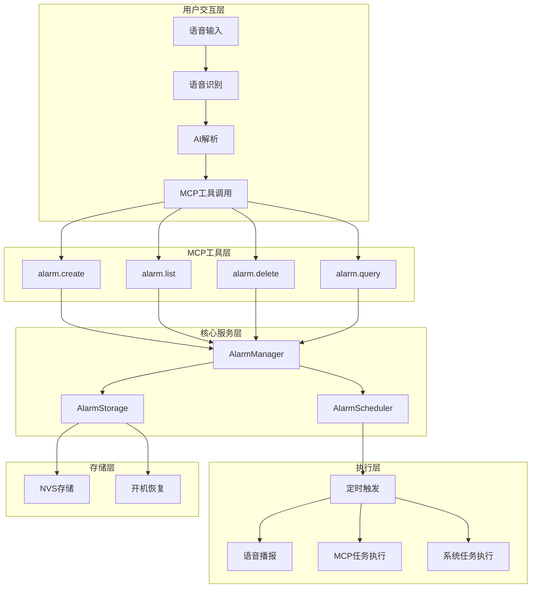

# 小智AI语音定时功能实现方案

## 概述

本文档详细描述了为小智AI聊天机器人增加语音定时功能的完整实现方案。该功能允许用户通过语音指令设置定时提醒，支持多种时间模式和执行方式，并利用项目现有的MCP协议实现通用化设计。

## 功能需求分析

### 核心功能
1. **语音设置闹钟**：用户语音输入"请在xxx时间做xxxx事情"，系统解析并创建定时任务
2. **语音播报提醒**：到时后语音播报"xxx的时间到了"
3. **多闹钟管理**：支持设置多个同时生效的闹钟
4. **语音查询**：可以语音查询当前生效中的闹钟信息
5. **自动清理**：已失效的闹钟自动删除
6. **频次设置**：支持"每个月的第一天"、"每周周三、五早上9点"等重复模式
7. **任务执行**：不仅语音提醒，还可执行系统或MCP支持的工作
8. **持久化存储**：闹钟设置不会因断电、关机而丢失
9. **开机恢复**：开机时播报关机期间错过的闹钟事件

### 技术约束
- 利用项目标准的MCP协议
- 脱离硬件板子限制，做成通用功能
- 遵循项目现有的架构设计模式

## 系统架构设计

### 整体架构图



### 核心组件

#### 1. AlarmManager（闹钟管理器）
- **职责**：闹钟的CRUD操作、状态管理、持久化
- **接口**：提供MCP工具调用的核心逻辑
- **位置**：`main/alarm/alarm_manager.h` 和 `main/alarm/alarm_manager.cc`

#### 2. AlarmScheduler（定时调度器）
- **职责**：定时任务调度、触发检查、执行管理
- **接口**：基于ESP32定时器的高精度调度
- **位置**：`main/alarm/alarm_scheduler.h` 和 `main/alarm/alarm_scheduler.cc`

#### 3. AlarmStorage（存储管理）
- **职责**：闹钟数据的序列化、反序列化、NVS存储
- **接口**：JSON格式存储，支持增量更新
- **位置**：`main/alarm/alarm_storage.h` 和 `main/alarm/alarm_storage.cc`

#### 4. MCP工具集成
- **职责**：将闹钟功能暴露为MCP工具
- **接口**：遵循项目MCP工具规范
- **位置**：在`main/mcp_server.cc`中注册工具

## 数据结构设计

### 闹钟数据结构

```cpp
enum class AlarmType {
    ONCE,           // 一次性闹钟
    DAILY,          // 每天重复
    WEEKLY,         // 每周重复
    MONTHLY,        // 每月重复
    CUSTOM          // 自定义重复
};

enum class AlarmStatus {
    ACTIVE,         // 激活状态
    PAUSED,         // 暂停状态
    COMPLETED,      // 已完成
    EXPIRED         // 已过期
};

enum class AlarmAction {
    VOICE_REMINDER, // 语音提醒
    MCP_TASK,       // 执行MCP任务
    SYSTEM_TASK     // 执行系统任务
};

struct AlarmData {
    std::string id;                    // 唯一标识符
    std::string title;                  // 闹钟标题
    std::string description;            // 详细描述
    AlarmType type;                     // 闹钟类型
    AlarmStatus status;                 // 当前状态
    AlarmAction action;                 // 执行动作
    
    // 时间相关
    time_t trigger_time;               // 触发时间（绝对时间）
    int hour;                          // 小时（0-23）
    int minute;                        // 分钟（0-59）
    int second;                        // 秒（0-59）
    
    // 重复设置
    std::vector<int> weekdays;         // 星期几（0-6，0=周日）
    int day_of_month;                  // 每月第几天（1-31）
    int interval_days;                 // 间隔天数（自定义重复）
    
    // 执行参数
    std::string voice_message;          // 语音播报内容
    std::string mcp_tool_name;          // MCP工具名称
    std::string mcp_tool_params;        // MCP工具参数（JSON）
    std::string system_command;          // 系统命令
    
    // 元数据
    time_t created_time;               // 创建时间
    time_t last_triggered;             // 最后触发时间
    int trigger_count;                 // 触发次数
    time_t next_trigger_time;          // 下次触发时间
    
    // 持久化相关
    bool dirty;                        // 是否需要保存
    bool deleted;                      // 是否已删除
};
```

### 存储格式（JSON）

```json
{
  "version": "1.0",
  "alarms": [
    {
      "id": "alarm_001",
      "title": "起床提醒",
      "description": "每天早上7点起床",
      "type": "DAILY",
      "status": "ACTIVE",
      "action": "VOICE_REMINDER",
      "hour": 7,
      "minute": 0,
      "second": 0,
      "voice_message": "起床的时间到了",
      "created_time": 1703123456,
      "last_triggered": 0,
      "trigger_count": 0,
      "next_trigger_time": 1703127000
    },
    {
      "id": "alarm_002",
      "title": "播报温度",
      "description": "每2小时播报一次室内温度",
      "type": "CUSTOM",
      "status": "ACTIVE",
      "action": "MCP_TASK",
      "interval_days": 0,
      "interval_hours": 2,
      "mcp_tool_name": "self.sensors.get_temperature",
      "mcp_tool_params": "{}",
      "created_time": 1703123456,
      "last_triggered": 0,
      "trigger_count": 0,
      "next_trigger_time": 1703130056
    }
  ]
}
```

## MCP工具设计

### 1. alarm.create - 创建闹钟

**工具名称**：`self.alarm.create`

**描述**：
```
Create a new alarm/reminder. Supports various time formats and repetition patterns.
Examples:
- "明天早上8点提醒我开会" -> once alarm
- "每天早上7点提醒我起床" -> daily alarm  
- "每周一、三、五晚上9点提醒我运动" -> weekly alarm
- "每月1号提醒我交房租" -> monthly alarm
- "每2小时播报一次温度" -> custom interval alarm
```

**参数**：
```cpp
PropertyList({
    Property("title", kPropertyTypeString, "闹钟标题"),
    Property("description", kPropertyTypeString, "详细描述"),
    Property("time_expression", kPropertyTypeString, "时间表达式，如'明天早上8点'、'每天早上7点'等"),
    Property("voice_message", kPropertyTypeString, "语音播报内容"),
    Property("action_type", kPropertyTypeString, "执行类型：voice_reminder/mcp_task/system_task"),
    Property("mcp_tool_name", kPropertyTypeString, "MCP工具名称（当action_type为mcp_task时）"),
    Property("mcp_tool_params", kPropertyTypeString, "MCP工具参数JSON（当action_type为mcp_task时）"),
    Property("system_command", kPropertyTypeString, "系统命令（当action_type为system_task时）")
})
```

**示例调用**：
```json
{
  "name": "self.alarm.create",
  "arguments": {
    "title": "起床提醒",
    "description": "每天早上7点起床",
    "time_expression": "每天早上7点",
    "voice_message": "起床的时间到了",
    "action_type": "voice_reminder"
  }
}
```

### 2. alarm.list - 列出闹钟

**工具名称**：`self.alarm.list`

**描述**：
```
List all active alarms/reminders. Can filter by status or type.
```

**参数**：
```cpp
PropertyList({
    Property("status", kPropertyTypeString, "状态过滤：active/all/completed/expired"),
    Property("type", kPropertyTypeString, "类型过滤：once/daily/weekly/monthly/custom")
})
```

### 3. alarm.delete - 删除闹钟

**工具名称**：`self.alarm.delete`

**描述**：
```
Delete an alarm/reminder by ID or title.
```

**参数**：
```cpp
PropertyList({
    Property("id", kPropertyTypeString, "闹钟ID"),
    Property("title", kPropertyTypeString, "闹钟标题（可选，用于模糊匹配）")
})
```

### 4. alarm.query - 查询闹钟

**工具名称**：`self.alarm.query`

**描述**：
```
Query alarms by various criteria. Supports natural language queries.
Examples:
- "我有哪些闹钟？"
- "明天有什么提醒？"
- "每周的闹钟有哪些？"
```

**参数**：
```cpp
PropertyList({
    Property("query", kPropertyTypeString, "查询表达式")
})
```

### 5. alarm.pause - 暂停闹钟

**工具名称**：`self.alarm.pause`

**描述**：
```
Pause or resume an alarm.
```

**参数**：
```cpp
PropertyList({
    Property("id", kPropertyTypeString, "闹钟ID"),
    Property("pause", kPropertyTypeBoolean, "true=暂停，false=恢复")
})
```

## 时间解析引擎

### 自然语言时间解析

设计一个灵活的时间解析引擎，支持中文自然语言：

```cpp
class TimeExpressionParser {
public:
    struct ParsedTime {
        AlarmType type;
        int hour;
        int minute;
        int second;
        std::vector<int> weekdays;
        int day_of_month;
        int interval_hours;
        int interval_days;
        time_t base_time;  // 基准时间
    };
    
    static ParsedTime Parse(const std::string& expression, time_t base_time = 0);
    
private:
    static ParsedTime ParseOnce(const std::string& expr, time_t base_time);
    static ParsedTime ParseDaily(const std::string& expr);
    static ParsedTime ParseWeekly(const std::string& expr);
    static ParsedTime ParseMonthly(const std::string& expr);
    static ParsedTime ParseCustom(const std::string& expr);
};
```

### 支持的时间表达式

1. **一次性闹钟**：
   - "明天早上8点"
   - "后天下午3点30分"
   - "下周一上午9点"
   - "12月25日晚上8点"

2. **每日重复**：
   - "每天早上7点"
   - "每天晚上10点"
   - "每天中午12点"

3. **每周重复**：
   - "每周一早上8点"
   - "每周三、五晚上9点"
   - "每周一到周五早上7点"

4. **每月重复**：
   - "每月1号早上8点"
   - "每月15号晚上8点"

5. **自定义间隔**：
   - "每2小时"
   - "每30分钟"
   - "每3天"

## 定时调度器设计

### ESP32定时器集成

```cpp
class AlarmScheduler {
public:
    AlarmScheduler();
    ~AlarmScheduler();
    
    // 添加闹钟到调度器
    bool AddAlarm(const AlarmData& alarm);
    
    // 从调度器移除闹钟
    bool RemoveAlarm(const std::string& alarm_id);
    
    // 更新闹钟
    bool UpdateAlarm(const AlarmData& alarm);
    
    // 检查并触发到时的闹钟
    void CheckAndTrigger();
    
    // 计算下次触发时间
    time_t CalculateNextTriggerTime(const AlarmData& alarm);
    
private:
    esp_timer_handle_t check_timer_;
    std::map<std::string, AlarmData> active_alarms_;
    std::mutex alarms_mutex_;
    
    // 定时检查回调
    static void OnTimerCallback(void* arg);
    
    // 触发闹钟
    void TriggerAlarm(const AlarmData& alarm);
    
    // 执行语音提醒
    void ExecuteVoiceReminder(const AlarmData& alarm);
    
    // 执行MCP任务
    void ExecuteMcpTask(const AlarmData& alarm);
    
    // 执行系统任务
    void ExecuteSystemTask(const AlarmData& alarm);
};
```

### 调度策略

1. **高精度检查**：每30秒检查一次到时的闹钟
2. **智能触发**：避免重复触发，记录最后触发时间
3. **批量处理**：同时到时的多个闹钟批量处理
4. **错误恢复**：触发失败时记录日志，不影响其他闹钟

## 持久化存储设计

### NVS存储策略

```cpp
class AlarmStorage {
public:
    AlarmStorage();
    ~AlarmStorage();
    
    // 保存所有闹钟
    bool SaveAllAlarms(const std::map<std::string, AlarmData>& alarms);
    
    // 加载所有闹钟
    bool LoadAllAlarms(std::map<std::string, AlarmData>& alarms);
    
    // 保存单个闹钟
    bool SaveAlarm(const AlarmData& alarm);
    
    // 删除闹钟
    bool DeleteAlarm(const std::string& alarm_id);
    
    // 清理过期闹钟
    bool CleanupExpiredAlarms();
    
private:
    static const char* NVS_NAMESPACE;
    static const char* ALARMS_KEY;
    
    nvs_handle_t nvs_handle_;
    
    // JSON序列化/反序列化
    std::string SerializeAlarms(const std::map<std::string, AlarmData>& alarms);
    bool DeserializeAlarms(const std::string& json, std::map<std::string, AlarmData>& alarms);
    
    // 单个闹钟序列化
    std::string SerializeAlarm(const AlarmData& alarm);
    bool DeserializeAlarm(const std::string& json, AlarmData& alarm);
};
```

### 存储优化

1. **增量更新**：只保存修改的闹钟
2. **压缩存储**：使用JSON压缩减少存储空间
3. **版本控制**：支持存储格式版本升级
4. **备份恢复**：支持数据备份和恢复

## 开机恢复机制

### 启动时检查

```cpp
class AlarmRecovery {
public:
    // 开机时检查错过的闹钟
    static void CheckMissedAlarms();
    
private:
    // 计算关机期间错过的闹钟
    static std::vector<AlarmData> GetMissedAlarms(time_t shutdown_time, time_t startup_time);
    
    // 播报错过的闹钟
    static void AnnounceMissedAlarms(const std::vector<AlarmData>& missed_alarms);
    
    // 更新闹钟状态
    static void UpdateAlarmStatus(const std::vector<AlarmData>& missed_alarms);
};
```

### 恢复流程

1. **启动检查**：系统启动时检查上次关机时间
2. **计算错过**：计算关机期间应该触发的闹钟
3. **批量播报**：一次性播报所有错过的闹钟
4. **状态更新**：更新闹钟的触发状态和次数
5. **重新调度**：重新计算下次触发时间

## 集成到现有系统

### 1. MCP服务器集成

在`main/mcp_server.cc`的`AddCommonTools()`中添加：

```cpp
void McpServer::AddCommonTools() {
    // ... 现有工具 ...
    
    // 闹钟管理工具
    AddTool("self.alarm.create",
        "Create a new alarm/reminder with natural language time expressions",
        PropertyList({
            Property("title", kPropertyTypeString),
            Property("description", kPropertyTypeString),
            Property("time_expression", kPropertyTypeString),
            Property("voice_message", kPropertyTypeString),
            Property("action_type", kPropertyTypeString, "voice_reminder"),
            Property("mcp_tool_name", kPropertyTypeString),
            Property("mcp_tool_params", kPropertyTypeString)
        }),
        [](const PropertyList& properties) -> ReturnValue {
            auto& alarm_manager = AlarmManager::GetInstance();
            return alarm_manager.CreateAlarm(properties);
        });
    
    AddTool("self.alarm.list",
        "List all active alarms/reminders",
        PropertyList({
            Property("status", kPropertyTypeString, "active"),
            Property("type", kPropertyTypeString)
        }),
        [](const PropertyList& properties) -> ReturnValue {
            auto& alarm_manager = AlarmManager::GetInstance();
            return alarm_manager.ListAlarms(properties);
        });
    
    // ... 其他闹钟工具 ...
}
```

### 2. 应用层集成

在`main/application.cc`中集成：

```cpp
void Application::Start() {
    // ... 现有初始化代码 ...
    
    // 初始化闹钟管理器
    auto& alarm_manager = AlarmManager::GetInstance();
    alarm_manager.Initialize();
    
    // 检查错过的闹钟
    AlarmRecovery::CheckMissedAlarms();
    
    // ... 其他初始化代码 ...
}
```

### 3. 板子通用化

在`main/boards/common/board.h`中添加通用接口：

```cpp
class Board {
public:
    // ... 现有接口 ...
    
    // 闹钟相关接口
    virtual AlarmManager* GetAlarmManager() {
        return &AlarmManager::GetInstance();
    }
};
```

## 实现步骤

### 阶段1：核心框架（1-2周）
1. 创建基础数据结构
2. 实现AlarmManager核心功能
3. 实现AlarmStorage持久化
4. 创建基础MCP工具

### 阶段2：调度器实现（1周）
1. 实现AlarmScheduler定时调度
2. 集成ESP32定时器
3. 实现闹钟触发逻辑
4. 测试定时精度

### 阶段3：时间解析（1-2周）
1. 实现TimeExpressionParser
2. 支持中文自然语言解析
3. 实现各种重复模式
4. 测试时间解析准确性

### 阶段4：MCP工具完善（1周）
1. 完善所有MCP工具
2. 实现查询和过滤功能
3. 集成到MCP服务器
4. 测试工具调用

### 阶段5：开机恢复（1周）
1. 实现AlarmRecovery机制
2. 集成到应用启动流程
3. 测试关机恢复功能
4. 优化用户体验

### 阶段6：测试优化（1-2周）
1. 全面功能测试
2. 性能优化
3. 内存使用优化
4. 错误处理完善

## 测试方案

### 单元测试
1. **时间解析测试**：测试各种时间表达式的解析准确性
2. **调度器测试**：测试定时触发的时间和精度
3. **存储测试**：测试数据的保存和加载
4. **MCP工具测试**：测试工具的参数验证和返回值

### 集成测试
1. **语音交互测试**：测试完整的语音设置到播报流程
2. **多闹钟测试**：测试多个闹钟同时工作的场景
3. **重复闹钟测试**：测试各种重复模式的正确性
4. **开机恢复测试**：测试关机重启后的恢复功能

### 压力测试
1. **大量闹钟测试**：测试100+闹钟的性能表现
2. **频繁触发测试**：测试短间隔闹钟的稳定性
3. **内存泄漏测试**：长时间运行的内存使用情况
4. **存储压力测试**：大量数据的存储和读取性能

## 性能考虑

### 内存优化
1. **对象池**：复用AlarmData对象减少内存分配
2. **字符串优化**：使用string_view减少字符串拷贝
3. **容器优化**：选择合适的容器类型和大小
4. **缓存策略**：合理缓存计算结果

### CPU优化
1. **定时器精度**：平衡检查频率和CPU使用
2. **批量处理**：批量处理多个闹钟减少上下文切换
3. **异步执行**：异步执行MCP任务避免阻塞
4. **智能调度**：根据闹钟密度调整检查频率

### 存储优化
1. **增量保存**：只保存修改的数据
2. **压缩存储**：使用JSON压缩减少存储空间
3. **分片存储**：大量数据分片存储
4. **清理策略**：定期清理过期数据

## 错误处理

### 异常情况处理
1. **时间解析失败**：提供友好的错误提示
2. **存储失败**：重试机制和降级处理
3. **MCP任务失败**：记录日志不影响其他闹钟
4. **定时器异常**：自动恢复和错误报告

### 日志记录
1. **操作日志**：记录所有闹钟操作
2. **错误日志**：记录异常和错误信息
3. **性能日志**：记录性能相关数据
4. **调试日志**：详细的调试信息

## 扩展性设计

### 未来功能扩展
1. **智能提醒**：基于用户习惯的智能提醒
2. **位置提醒**：基于GPS的位置相关提醒
3. **协作提醒**：多设备间的提醒同步
4. **AI优化**：基于AI的提醒时间优化

### 接口扩展
1. **REST API**：提供HTTP接口供外部调用
2. **WebSocket**：实时推送闹钟状态
3. **MQTT**：通过MQTT协议同步闹钟
4. **云端同步**：云端备份和同步功能

## 总结

本方案提供了一个完整的语音定时功能实现方案，具有以下特点：

1. **架构清晰**：模块化设计，职责分离
2. **功能完整**：覆盖所有需求功能
3. **技术先进**：利用ESP32硬件特性和MCP协议
4. **扩展性强**：支持未来功能扩展
5. **性能优化**：考虑内存、CPU、存储优化
6. **通用设计**：脱离硬件限制，适用于所有板子

该方案遵循项目现有的架构模式，充分利用MCP协议的优势，为用户提供智能、便捷的语音定时功能。
